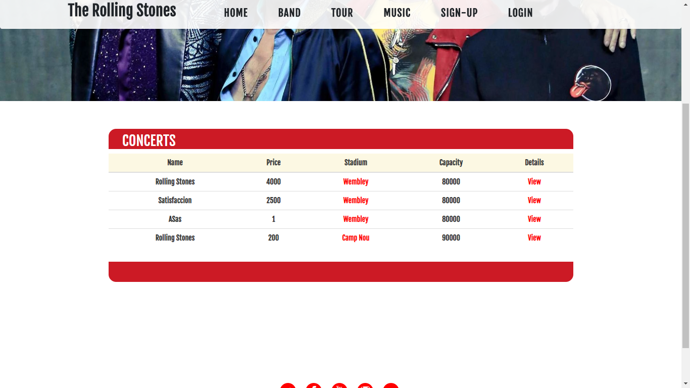
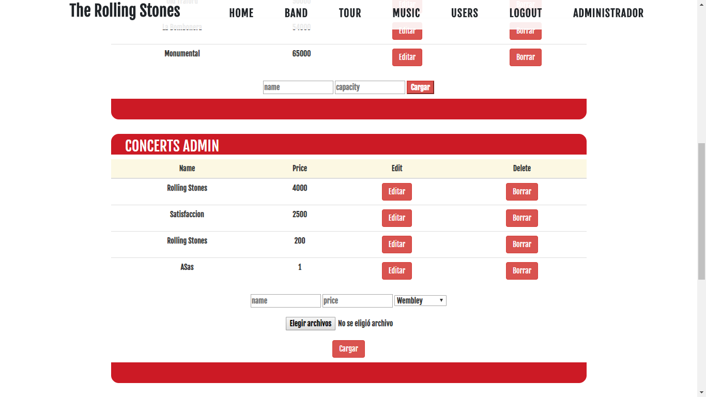
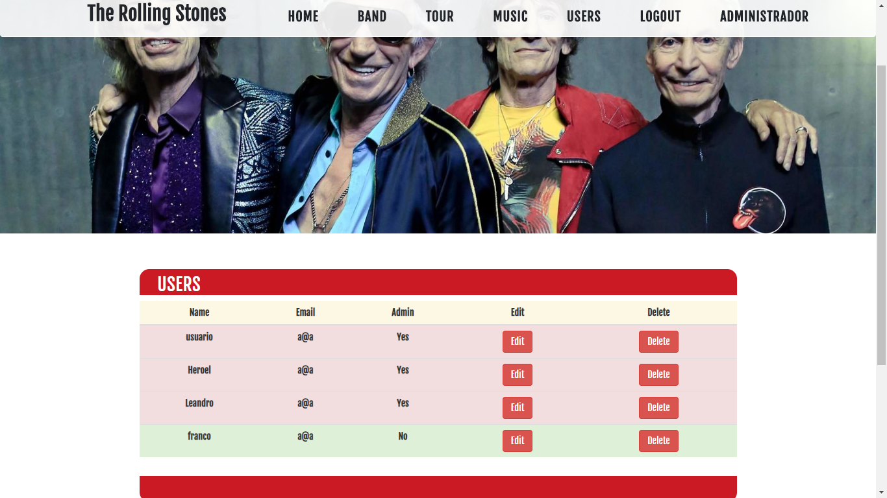



#EstadiosModel [Listo]

Se puede obtener (get), eliminar (delete), editar (edit) y agregar (insert) estadios.
Se puede obtener un estadio por ID. (getId).

#RecitalesModel [Listo]

Se puede obtener (get), agregar (insert) y eliminar (delete).
Se puede obtener un recital por ID. (getById).

#UsuarioModel [Listo]

Se pueden obtener los usuarios (getAll)
Se puede añadir usuarios (insert)
Se puede obtener el hash de la base de dato de un usuario en particular (getHash)
Se puede pedir un usuario en especifico (getName)
Se puede pedir el ultimo usuario registrado (getLastId)

#ComentariosModel [Listo]

Se puede insetar, eliminar y obtener comentarios.

#TourView [En construccion]

Añadido formulario para cargar estadios.
Añadido formulario para cargar recitales.
Se muestra la tabla con todo los recitales y estadios.

#UsuariosAdminController [Listo]

Muestra todo los usuarios registrados si se es administrador
Se agregaron botones de eliminar y editar
Se puede eliminar usuarios
Se puede editar usuarios

#UsuariosController [Listo]

Se encriptan las contraseñas de los usuarios
Se verifica que el usuario no exista en la base de datos, para no tener usuarios duplicados

#LoginController [Listo]

Se verifica la password ingresada con el hash de la base de datos
Verificar si el nombre de usuario que se ingresa existe

#LoginView [Listo]

Añadido formulario para loguearse

#UsuariosView [Listo]

Añadido formulario para registrarse
Añadida vista de todo los usuarios para los administradores

#NavegacionView [Listo]

En esta sección se encuentra todo el contenido estatico de la página

#Smarty [Listo]

Añadidas las librerias de smarty
Añadidas vistas para Home, Music, Band, Tour, SignUp, Login

#Header.tpl [Listo]

Verifica si el usuario esta logueado o no y si es adminitrador del sitio o no.
Muestra una barra de navegación diferente al usuario no logueado, usuario y administrador

#Necesario:

Preguntar SERVER_PORT de Smarty en el base href
